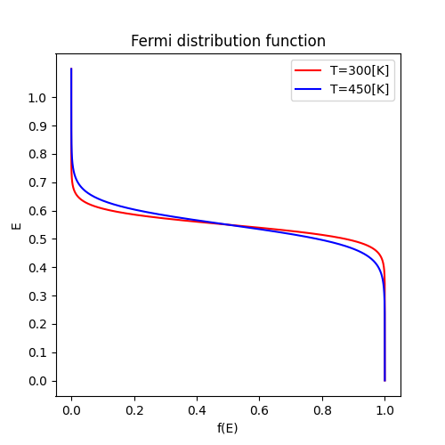

3i30 廣垣凜太郎



コード
```py
import math
import matplotlib.pyplot as plt
import numpy

T_1 = 300       #[K]
T_2 = 450       #[K]
k = 1.38E-23    #ボルツマン定数
eV = 1.6E-19    #[J]→[eV]に変換
Ef = 0.55       
e = math.e


fig = plt.figure(figsize=(5, 5))
a = fig.add_subplot(1, 1, 1)

x = numpy.linspace(0, 1.1, 1000)
y1 = 1 / (1 + e**((x - Ef)*eV / (k*T_1)))
y2 = 1 / (1 + e**((x - Ef)*eV / (k*T_2)))   

#plot
a.plot(y1, x,  color = "red", label ="T=300[K]")    
a.plot(y2, x, color = "blue", label ="T=450[K]")

#label   
a.set_xlabel("f(E)")
a.set_ylabel("E")
a.legend(loc=0)

#title
a.set_title("Fermi distribution function")
#ticks
a.set_yticks(numpy.arange(0, 1.1, step = 0.1))

plt.show()
```